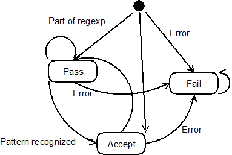
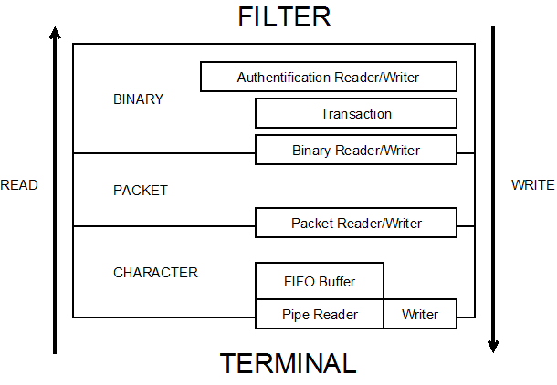
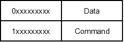
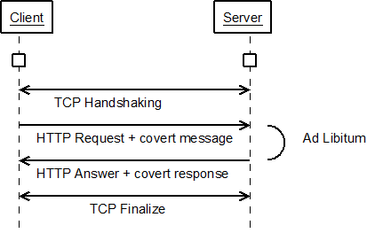
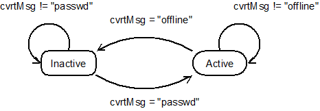

Project Developpement Name : Covert Python
==========================================

- Overview
  - Developpement team
  - Architecture
  - Case study
  - Filtering
  - Protocol
  - Applications
  - Troubleshooting
  - Code release
  - Bibliography

Project Developpement Name : Covert Python
==========================================

ImageCovertPython

Overview
--------

The goal of this project, is to implement a covert channel over TCP, and
encapsulated protocol. The tunnel engine will be based on a filter system, that
will provide some kind of modules so as to hide messages within differents
protocols that use TCP (e.g. HTTP).

For the moment, the project is coded with python. What implies the current
developpement name.

What is a covert channel ? By the words covert channel we mean : a
communication channel which remains undetectable, hiding its data over an
existing communication channel.

The covert channel must transfert messages without alteration of the legal
message. In fact, modification of the initial message IS perfomed, but in a way
such as those changes remains non visible.

The final use of this project is documented in the "Use and Abuse" section.

Developpement team
------------------

Michaël Coquard (layteman@yahoo.fr)

Yves Stadler (yves.stadler@univ-metz.fr)

Masters of Science in IT security (Formerly at Paul Verlaine University - Metz)

Architecture
------------

work in progress

### Description de l’architecture

### Definitions

Client : Describes all that is located on the source side of the communication
(also called left side).

Server : Describes all that is located at the destination side of the
communication (also called right side).

Covert python client : (alias CPClient, or CPC) Describes the software that
obfuscate the content on the client side.

Covert python server : (alias CPServer , or CPS) Describes the software that
clarify the content on the client side.

Covert python server reverser : (alias CPSReverser, or CPSR) Describes the
software that obfuscate the content on the server side, so that it can reply to
the client covert message.

Covert python client reverser : (alias CPCReverser, or CPCR) Describes the
software that clarify the content on the client side, so that it can read the
server covert answer.

Covert message : Describe the clear text message that travel the covert
channel.

Obfuscated message : Describe the covert message form on the visible channel.
Schematics

An application organisation design poster

The schematics show a communication example from client to server. The reverse
process is also possible (that is to say, server to client) in a similar
communication.

Case study
----------

A Case study description
### Space extender

rfc

The space extender is based on the fact that extra-spacing in the HTML
(HyperText? Markup Language) is not rendered into web-browser.

This fact known, it can be easily used to pass covert messages by encoding them
as extra-space. For each space found into the HTML content send to the server,
the next covert message character is encoded as 1 extra-space by order in
alphabet. (e.g. A is encoded as 1 extra-space, B as 2 extra-space, …)

On the server-side, HTML contents are parsed to clarify the obfuscated message,
with the reverse process.

At this time, there is no protocol to check wether the message is obfuscated or
not. This will be done either on a pre-analyze sequence, that is to say before
running the script of clarification, or on a post-analyze sequence, after the
clarification process. (cf. protocol section)

Note: We must be carefull about some HTML specifications such as the `<pre>` tag,
in which space as a special value.
HTTP permutations

draft

For purpose of implementation, a filter for use over HTTP has been developped.

Concept is base on the factorial number of possibility that offers
permutations.

So as to make this operationnal, an order for HTTP headers should be defined.
In this example, we took alphabetical order.

The more headers, the more bits can be encoded by permutation.

Mettre ici l’algorithme de permutation?

Example :

This following HTTP request can encode one bit. The headers "Host" and
"Content-Length" are in lexicographic order which mean a value of "0" :

    GET / HTTP/1.1\r\n
    Content-Length: 12\r\n
    Host: 172.16.1.1\r\n
    \r\n
    blablablabla

In the following HTTP request, the two headers are inverted which mean a value
of "1" :

    GET / HTTP/1.1\r\n
    Host: 172.16.1.1\r\n
    Content-Length: 12\r\n
    \r\n
    blablablabla

HTML tags permutations
----------------------
draft

The principle is the same that the HTTP permutations except in this case, we
use attribute permutations in HTTP tags to hide some data.

Example :

The following tag can encode 2 bits of data (6 = 3! permutations of attributes
are possible) :

Filtering
---------

The filtering system is based on two kernels :

    The regular expression engine
    The Filter/Terminal Stack

In the next sections, we’ll describe those two kernels, and how to implements a
filter
### Regular Expressions

So as to implements automatas that act "on the fly" (that is to say, character
by character), reimplementation of regular expression treatment has been
necessary.

The regexp engine is based on Russ Cox algortihm
(http://swtch.com/~rsc/regexp/regexp1.html), and provides translation between
regexp and automatas.

A regexp object is passing through those states :

Functions

To use the regexp module, it has to be imported first

    import stepregexp as re

To create a new regexp object :

    p = re.compile("[A-Z]+")

To reinitialise the regexp :

    p.reset()

To pass the next character to the engine :

    p.next('c')

cette fonction renvoie toujours le numéro de l’état du moteur :

    0 (PASS) : the regexp is not recognised, but may be with the next
characters to come
    1 (FAIL) : the regexp recongnition has failed
    2 (ACCEPT) : the regexp is recognised

    p.isAccepted()

will return true if the regexp engine is in ACCEPT state.
### Filter/Terminal Stack

#### Layer 1 : Binary

The binary layer is the one who directly interact with the binary flow.

    The binary writer is intended to provide the 2nd layer a packet read from
the binary flow
    The binary reader‘s goal is to write a packer provided by the packet layer
on the binary flow

The authentification module has the mission of authentificate a covert client.
In fact, a new TCP/IP connection shall be initaited by neither a client who can
create covert message, or by a legal client.

Authentification is describe in the protocol section.

The transaction module has charge of committing or rollbacking the data asked
to be transmitted. It relies on the result of the send() command. This is
necessary while it could not be determined when the TCP/IP will be ended.

This module should handle problems occuring when a connection trouble appears.

#### Layer 2 : Packet

The packet layer is in charge of treating a packet.

A packet is not the same unit as in the well-known TCP/IP stack. In our
architecture, a packet is composed by 9 bits of data. Packets beginning with
the 1 bit, is a command that has to be performed by the engine. (e.g. a
protocol message) Those packets do not contains data to be send to a terminal
session.

Packet beggining with the 0 bit, is a data packet. Data has to be checked by
the covert engine for hidden message.

    The packet reader takes character provide by the upper layer, and returns a
packet.
    The packet writer takes packet and returns character to the next layer.

#### Layer 3 : Character

The character layer is made to handle character level communication with
terminal session.

    The pipe writer is used to transmit character to the terminal.
    The pipe reader is used to read from the terminal. It is used in
conjonction with the FIFO buffer to store the commands read from terminal
session, since all the characters may not be used as fast as they come in.

### Filter creation

To write a new filter, two class must be implemented :

 - the AbstractTerminalFilterIn
 - the AbstractTerminalFilterOut

AbstractTerminalFilterIn

Functions :

     __init__ : Constructor, initialise local variables. THe constructor take in
parameter an object of BinaryReader? class to get the binary input stream to
encode.
     read : read characters on the output buffer of the filter. These characters
can be modified by the filter or not.
     write : write a character in the filter. This method return the state of
the filter after the treatment of the character.
     reset : reset the filter (cf. init)

read() and write() can perform encoding of input binary stream.
AbstractTerminalFilterOut

Same functions but the constructor takes as parameter a BinaryWriter class to
write decoded stream.

Protocol
--------

The following chart paints a example of HTTP-covert communication :

As shown on the picture, the hidden communication takes place after a TCP/IP
connection is established. In order to make the covert client and client server
communicate in a proper way, client needs to be recognized. That’s why a
protocol is necessary.

The first part of this protocol is symbolised on the following figure :

### Covert server states

Authentification

Before any data can be transmitted to the upper layers of the F/T Stack, the
client must provide an authentification sequence, in order to make the server
aware of its presence.

Authentification is treated by the Authentification module.

In the same way, server must proceed to an authentification.
Authentification level

The authentification module :

 - enables recongnition of a compatible counterpart
 - does not identifie unique client

### Transaction
Protocol summary

Protocol

**Connection**
As soon as the TCP handshake is successful, the first covert message to
be transmitted is a passphrase;
The passphrase has to be resend whenever a TCP/IP connection is
created;

**Discontinuity of service**
When connection is taken down, great care must be taken to determine
what has been sent and what remains to be sent. Especially receiving buffer
must be treated before erase. **

Applications
------------

disclamer

Some case in which this project could be used :
### Use
#### Entropy

Entropy is obtained by using filter on protocols that have ni strict policy.
(e.g. HTML syntax, that can be used with no care of w3c recommandation) The
more the protocol can be used with modifications that does not affect its
normal function, the more entropy we can gather.
Analysis

This tool can also be used to perform traffic analysis, in order to find how to
detect such a traffic.

Moreover, it can be used to check the fiability of traffic analyser, by testing
if covert channel are detected as they should be by the piece of software being
tested.

#### Spywares

It is not clear wether this point should be considered as a use or an abuse.
But using covert channels in combination with a spyware can be a good way for
gathering information. This may interessed governemental organisations that
relies on data interception and disclosure, that can be done discretly with
that kind of software.

### Abuse

#### BotNets

Covert channels may be (are) used to operates bots within a botnet.

Example: with a corrupted installation of a IRC client containing the covert
server, one can send instructions by chatting with you.
Code execution

Covert channels can be used in conjonction with, for example, a forum to
transmit message to malicious software running on machine lambda. By simply
visiting a web page, a covert server installed on your computer may interpret
the page as commands (example: initiate a denial of service attack on X)
Virus transport

You can also transfer malicious software through the tunnel, for example by
sending fake emails.
### Disruption of covert channel
#### Proxies

Use of the cover channel through proxies (example of HTTP permutations
considered), may disturbed the covert channel if any of the proxy does not
rewrite the headers as they comes.

In general way, whenever data are not rewritten as they have been received
there is a chance that the covert message has been broken. In such a case this
mean that our filter is not appropriate for the use we need.

Troubleshooting
---------------
### Regular expressions
#### Non-deterministic automata

The python default regexp engine, is based on non-deterministics automatas. It
implies that this kind of regular expressions :

    import re
    re.match("a?a?a?a?a?a?a?a?a?a?a?a?a?a?a?a?a?a?a?a?a?a?a?a?a?a?a?a?a?a?a?a?a?a?a?a?a?a?a?a?a?a?a?a?a?a?a?a?a?a?a?a?a?a?a?a?a?a?a?a?a?a?a?a?a?aaaaaaaaaaaaaaaaaaaaaaaaaaaaaaaaaaaaaaaaaaaaaaaaaaaaaaaaaaaaaaaaaaaaaaaaaaaaaaaaaaaaa", "aaaaaaaaaaaaaaaaaaaaaaaaaaaaaaaaaaaaaaaaaaaaaaaaaaaaaaaaaaaaaaaaaaaaaaaaaaaaaaaaaaaaa")

Goes into a death loop.

This problem has been solved by implementing a new engine, that compile a
deterministic automata for regular expressions. The regexp engine is based on
Russ Cox algortihm [RE], and provides translation between regexp and automatas.
On the fly acting

The basic regexp engine does not provide way to act character by character.
That’s why the developpement of our engine does take care of this.

Bibliography

    [PERM] Martin Mares and Milan Straka, Linear-Time Ranking of Permutations
    [RE] Russ Cox, Regular Expression Matching Can Be Simple And Fast
    (http://swtch.com/~rsc/regexp/regexp1.html)
    [DE] Stephen Forrest, Deogol tool
